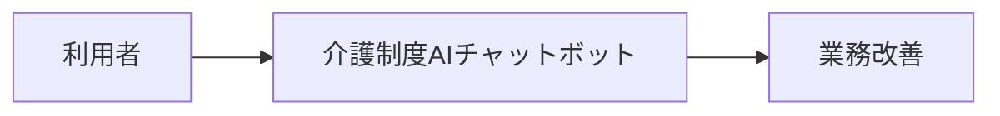
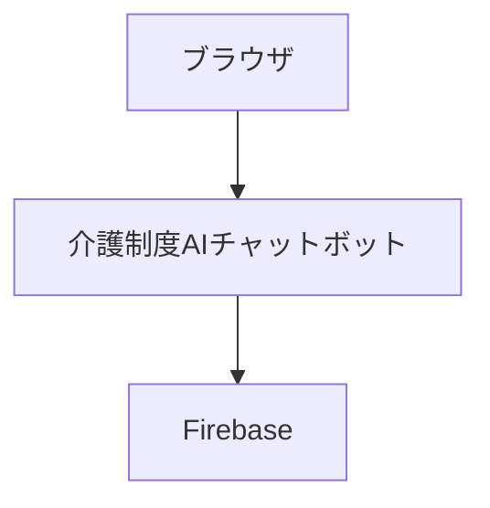
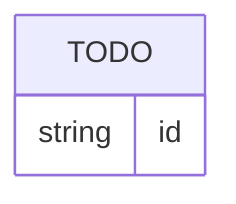
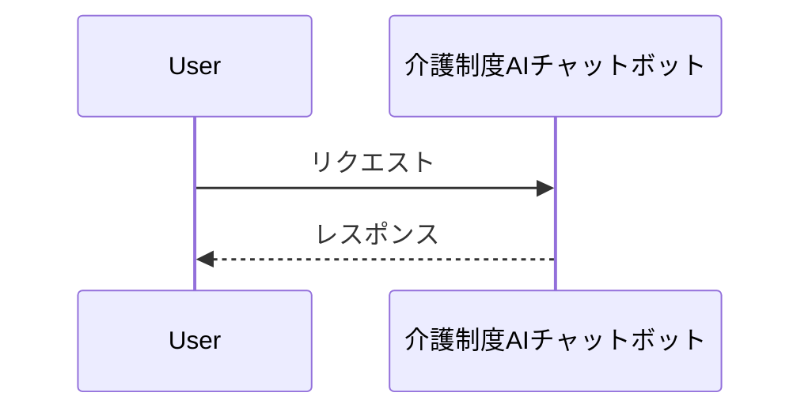

# 介護制度AIチャットボット — エンジニアノート

> **介護の疑問にAIが即答**
> 作成日: 2026-05-04 / 最終更新: 2026-05-04
> 状態: 稼働中

---

# 【Part A: 利用者・経営層向け】

## §0 コンセプト

スタッフ向けWebチャットUI。介護制度・法改正などの質問にAIが即答する。

## §1 背景・課題

> TODO: 導入の背景・解決したい課題を記載

## §2 効果・KPI

> TODO: 導入後の期待効果・測定指標を記載

## §3 ユースケース



### §3.3 他アプリとの関係

> TODO: 依存するアプリ・提供するサービスを記載

## §4 マニュアル

→ `docs/MANUAL.md` を参照

---

# 【Part B: エンジニア向け】

## §5 技術スタック

| 層 | 技術 |
|---|---|
| フロントエンド / バックエンド | Node.js/Express/Gemini AI/Cloud Run |
| 認証 | Firebase Auth / Google SSO |
| ホスティング | Firebase Hosting / Cloud Run |

## §6 アーキテクチャ



## §7 データモデル

> TODO: Firestoreコレクション・フィールド定義を記載



## §8 API・シーケンス



## §9 認証

Firebase Auth + Google SSO（signInWithPopup）

## §10 画面一覧

> TODO: 画面一覧を記載

## §11 デプロイ

```bash
npm run deploy:promote
```

## §12 ハマりポイント・注意事項

> TODO: 開発中に発見した地雷・注意事項を記載

---

# 【Part C: 開発記録】

## §13 開発中の状態・未決事項

> 状態: 稼働中

## §14 設計議論アーカイブ

## §15 ADR（アーキテクチャ決定記録）

## §16 変更履歴

| 日付 | 内容 |
|---|---|
| 2026-05-04 | 初版作成 |
